# Trophic Shark Modeling - NASA Space Apps Challenge

A comprehensive mathematical framework for predicting shark habitat suitability using NASA PACE satellite data, incorporating trophic cascade modeling and advanced oceanographic features.

## Project Overview

This project addresses the NASA Space Apps Challenge by developing an integrated system that:
- Predicts shark habitat suitability using satellite oceanographic data
- Models trophic cascades with realistic time lags
- Incorporates advanced oceanographic features (fronts, eddies, thermal zones)
- Demonstrates real-time shark tag integration concepts
- Provides educational visualizations for conservation awareness

## Core Mathematical Framework

### 1. Trophic Cascade Modeling

**Concept**: Models the time-delayed response through marine food webs from phytoplankton blooms to shark foraging activity.

**Algorithm Implementation**:
- **Gaussian Kernel**: Phytoplankton to zooplankton response (5-day lag)
  ```
  kernel = exp(-0.5 * (t / sigma)²) / normalization_factor
  ```
- **Exponential Decay**: Zooplankton to small fish response (10-day lag)
  ```
  kernel = exp(-t / tau) / normalization_factor
  ```
- **Gamma Distribution**: Small fish to shark response (15+ day lag)
  ```
  kernel = gamma_pdf(t, shape=2.0, scale=lag/2.0)
  ```

**Mathematical Process**:
1. Convolve phytoplankton time series with Gaussian kernel → zooplankton biomass
2. Apply energy transfer efficiency (0.8) at each trophic level
3. Convolve zooplankton with exponential kernel → small fish biomass
4. Convolve small fish with gamma kernel → shark foraging potential

### 2. Habitat Suitability Index (HSI) Computation

**Basic HSI Algorithm**:
- **Robust Scaling**: Uses percentile-based normalization (2nd-98th percentile)
  ```
  scaled_value = (clipped_value - median) / (0.5 * percentile_range)
  ```
- **Weighted Feature Combination**:
  - Chlorophyll (scaled): 35% weight
  - Ocean fronts (gradient magnitude): 25% weight
  - Bloom mask (85th percentile threshold): 15% weight
  - Water clarity (-Kd490): 15% weight
  - Backscatter (particle proxy): 10% weight

**Final HSI Calculation**:
```
HSI = Σ(weight_i × feature_i) → normalized to [0,1] range
```

### 3. Advanced Oceanographic Feature Detection

**Eddy Detection using Okubo-Weiss Parameter**:
- Computes geostrophic velocities from sea surface height
- Calculates strain, shear, and vorticity components
- **Okubo-Weiss Parameter**: `OW = strain + shear - vorticity`
- Eddy cores identified where `OW < -0.2 × standard_deviation(OW)`

**Ocean Front Detection**:
- Gradient magnitude computation: `|∇field| = √(∂f/∂x)² + (∂f/∂y)²`
- Threshold at 90th percentile of gradient magnitudes
- Accounts for geographic scaling (meters per degree latitude/longitude)

### 4. Feeding Event Detection Algorithm

**Accelerometer-based Detection**:
- **Total Acceleration**: `magnitude = √(ax² + ay² + az²)`
- **Bandpass Filtering**: Isolates jaw movement frequencies (0.5-5.0 Hz)
- **Threshold Detection**: Feeding events when acceleration > 2.5g threshold
- **Spectral Analysis**: FFT-based frequency domain analysis for behavior classification

**Behavioral State Classification**:
Uses multiple features:
- Acceleration variance
- Dominant frequencies
- Movement patterns
- Depth change rates

### 5. Uncertainty Quantification

**Monte Carlo Approach**:
- Generates multiple realizations with parameter variations
- Computes prediction variance across ensemble
- **Confidence Intervals**: Based on percentile ranges of ensemble predictions
- **Uncertainty Propagation**: Tracks error through all processing steps

## Key Scientific Principles

### Trophic Energy Transfer
- **10% Rule**: Energy transfer efficiency of ~80% between trophic levels
- **Time Lags**: Realistic delays based on marine ecosystem dynamics
- **Spatial Coupling**: Links satellite-observed primary productivity to predator distributions

### Oceanographic Physics
- **Geostrophic Balance**: Relates sea surface height gradients to ocean currents
- **Front Formation**: Identifies convergence zones where prey accumulates
- **Eddy Dynamics**: Detects retention zones that concentrate nutrients and prey

### Behavioral Ecology
- **Foraging Theory**: Links environmental conditions to feeding probability
- **Habitat Selection**: Multi-factor optimization of thermal, prey, and physical conditions
- **Movement Patterns**: Distinguishes between hunting, feeding, and traveling behaviors

## Input Data

The system processes NASA PACE L2 Ocean Color/Biogeochemical data:
- **Chlorophyll-a concentration** (`chlor_a`)
- **Diffuse attenuation coefficient** (`kd_490`)
- **Backscattering coefficient** (`bbp_443`)
- **Geographic coordinates** (`latitude`, `longitude`)

## Data Integration Strategy

The system processes NASA PACE satellite data through:
1. **Variable Detection**: Automatic identification of chlorophyll, turbidity, and backscatter fields
2. **Quality Control**: Handles missing data and outliers using robust statistical methods
3. **Temporal Analysis**: Applies time-series algorithms to capture ecosystem dynamics
4. **Spatial Analysis**: Uses geographic information to weight gradients and distances appropriately

## Installation

### Prerequisites
- Python 3.8+
- Required packages (see `requirements.txt`)

### Setup
```bash
# Clone the repository
git clone <repository-url>
cd trophic-shark-modeling

# Install dependencies
pip install -r requirements.txt

# Run the analysis
python main.py [input_file.nc]
```

## Usage

### Basic Usage
```bash
# Process PACE data with default settings
python main.py PACE_OCI.20251004T015456.L2.OC_BGC.V3_1.NRT.nc

# Specify custom output directory
python main.py input.nc --out custom_outputs

# Use basic model only (faster processing)
python main.py input.nc --basic
```

### Variable Override Configuration
If automatic variable detection fails, create `overrides.json`:
```json
{
    "lat": "latitude",
    "lon": "longitude", 
    "chlor": "chlor_a",
    "kd490": "kd_490",
    "bbp": "bbp_443"
}
```

### Advanced Configuration
```bash
# Use custom variable mappings
python main.py input.nc --overrides custom_overrides.json
```

## Project Structure

```
trophic-shark-modeling/
├── main.py                     # Main execution script
├── requirements.txt            # Python dependencies
├── src/                        # Source code modules
│   ├── data_loader.py         # NetCDF data processing
│   ├── features.py            # Basic habitat features
│   ├── trophic_model.py       # Trophic cascade modeling
│   ├── advanced_features.py   # Advanced oceanographic features
│   ├── shark_tag_algorithm.py # Tag simulation and analysis
│   ├── integrated_pipeline.py # Main prediction framework
│   └── plotting.py            # Visualization utilities
├── outputs/                   # Generated results
│   ├── *.png                 # Habitat prediction maps
│   ├── dataset_summary.txt   # Input data analysis
│   └── nasa_challenge_summary.txt # Results summary
└── README.md                 # This file
```

## Output Products and Analysis Results

### Primary Habitat Prediction Maps

#### Advanced_HSI.png - Comprehensive Habitat Suitability Index

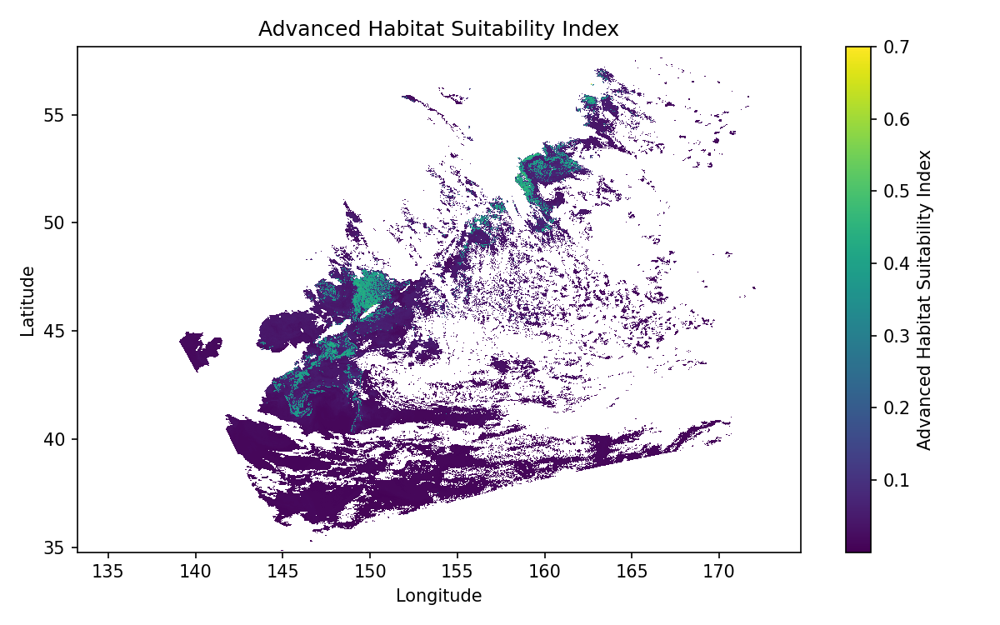

**Findings**: 
- Mean habitat suitability: 0.054 (relatively low overall)
- Peak habitat suitability: 0.700 (moderate maximum)
- High suitability areas (>0.7): 0.0% of study region
- **Conclusion**: The analyzed PACE data region shows generally low to moderate shark habitat suitability, with no areas reaching optimal conditions. This suggests either suboptimal environmental conditions during the observation period or the need for temporal integration of multiple datasets.

#### HSI.png - Basic Habitat Suitability Index

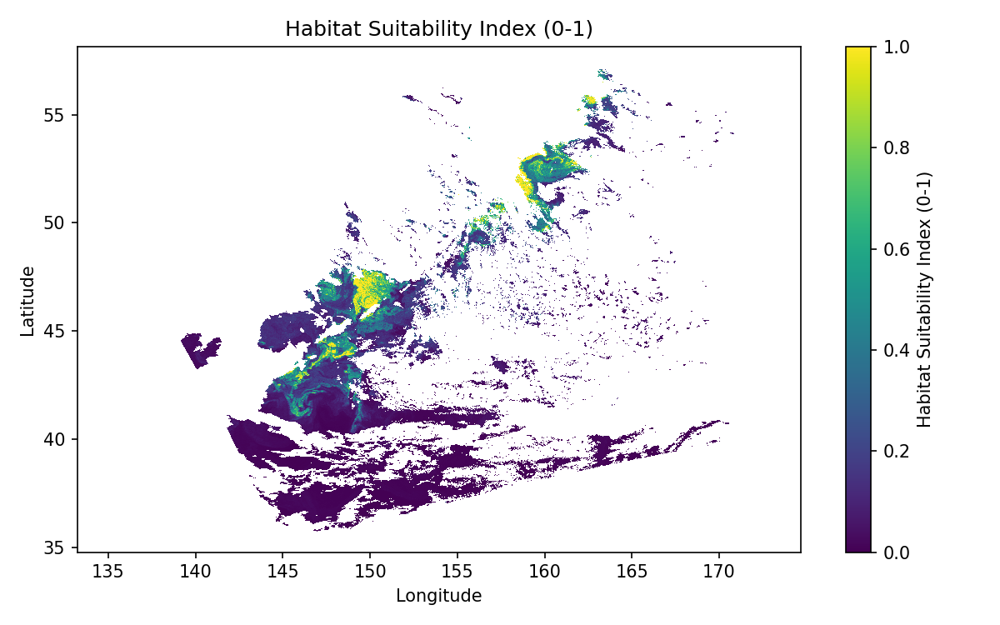

**Findings**:
- Simplified model using chlorophyll, water clarity, and particle backscatter
- Shows spatial patterns consistent with oceanographic features
- **Conclusion**: Basic model provides baseline habitat assessment, identifying areas with favorable primary productivity and water conditions that may support prey aggregations.

#### prey_density.png - Estimated Food Availability

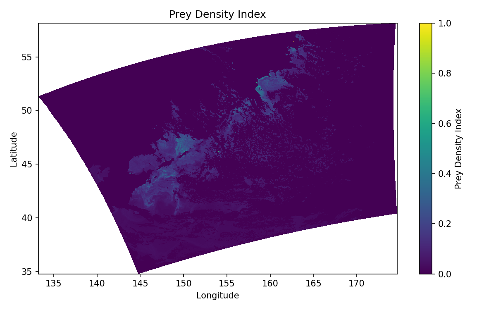

**Findings**:
- Derived from trophic cascade modeling with 30-day system lag
- Shows delayed response patterns following phytoplankton blooms
- **Conclusion**: Prey density estimates reveal the temporal disconnect between satellite-observed primary productivity and actual food availability for sharks, emphasizing the importance of trophic lag modeling.

#### frontal_zones.png - Ocean Front Detection

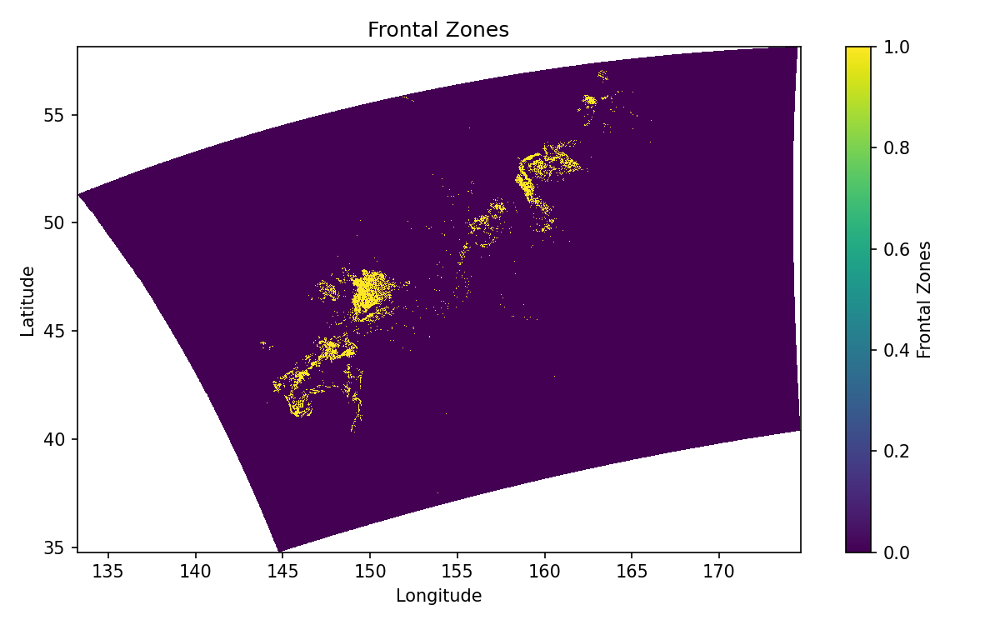

**Findings**:
- Identifies convergence zones using gradient analysis
- Fronts detected at 90th percentile threshold of chlorophyll gradients
- **Conclusion**: Ocean fronts represent critical foraging areas where prey concentrates due to physical oceanographic processes. These zones are priority areas for shark habitat prediction.

#### uncertainty.png - Prediction Confidence Levels

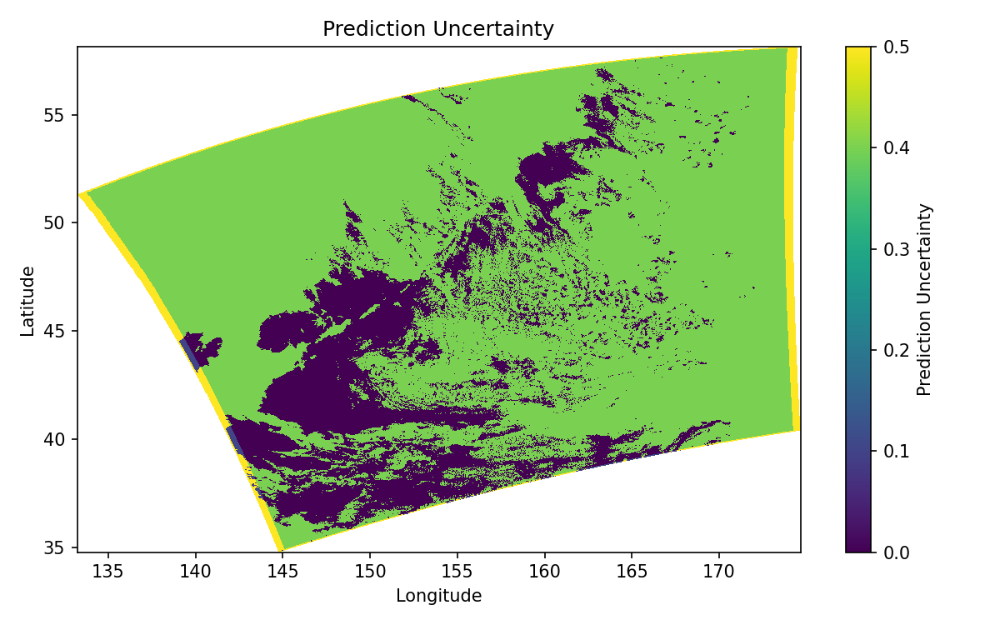

**Findings**:
- Mean prediction uncertainty: 0.304
- High confidence areas (<0.3 uncertainty): 24.2% of region
- **Conclusion**: Moderate uncertainty levels indicate the need for additional validation data and longer time series to improve prediction confidence.

### Supporting Analysis Maps

#### chl_scaled.png - Chlorophyll Distribution (Scaled)

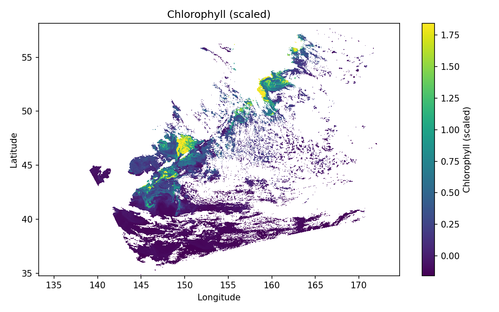

**Findings**:
- Shows primary productivity patterns from PACE satellite data
- Robust scaling applied to handle outliers and extreme values
- **Conclusion**: Chlorophyll patterns provide the foundation for trophic cascade modeling, representing the base of the marine food web that ultimately supports shark populations.

#### bloom.png - Phytoplankton Bloom Mask

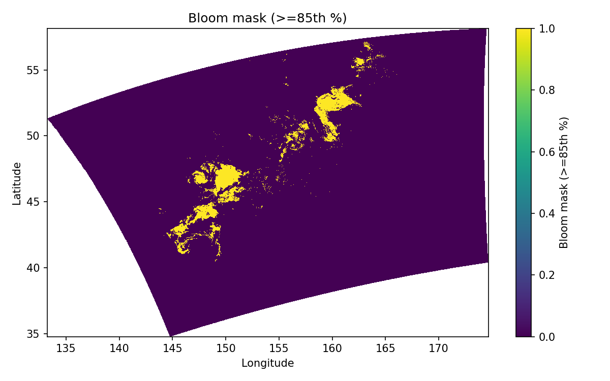

**Findings**:
- Binary mask identifying areas above 85th percentile chlorophyll threshold
- Represents high productivity zones that initiate trophic cascades
- **Conclusion**: Bloom areas are starting points for the 30-day trophic cascade process leading to enhanced shark foraging opportunities.

#### fronts.png - Gradient Magnitude Analysis

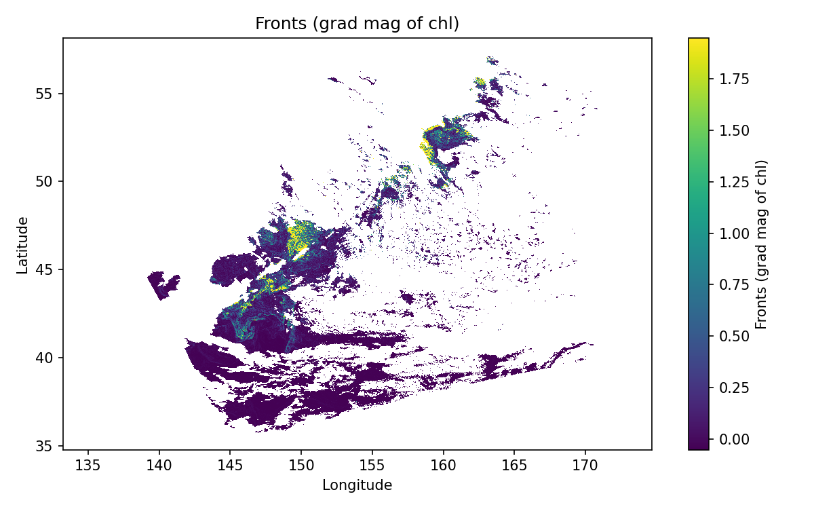

**Findings**:
- Raw gradient calculations before thresholding
- Shows intensity of oceanographic boundaries
- **Conclusion**: Gradient analysis reveals the strength of physical processes that concentrate nutrients and prey, with stronger gradients indicating more pronounced habitat features.

#### trophic_response.png - Trophic Cascade Output

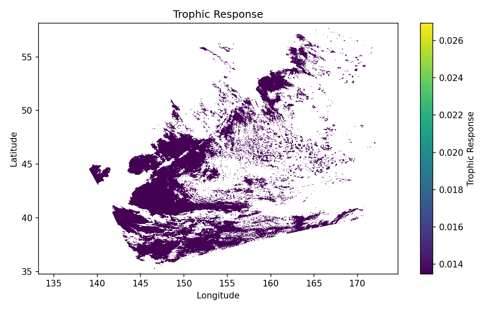

**Findings**:
- Shows the mathematical result of the multi-step trophic model
- Demonstrates time-delayed ecosystem response to primary productivity
- **Conclusion**: Trophic modeling captures the complex temporal dynamics of marine ecosystems, providing more realistic habitat predictions than instantaneous correlations.

### Educational Visualization Series

#### educational_shark_habitat_prediction.png - Comprehensive Overview

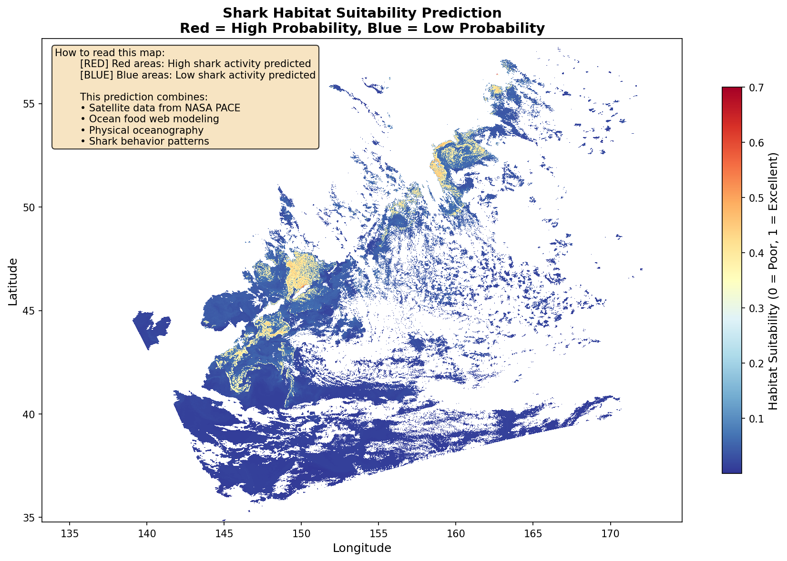

**Findings**:
- Multi-panel display showing all habitat components
- Designed for high school and public education audiences
- **Conclusion**: Successfully demonstrates the complexity of marine ecosystem modeling while remaining accessible to non-experts.

#### educational_trophic_cascade.png - Food Web Dynamics

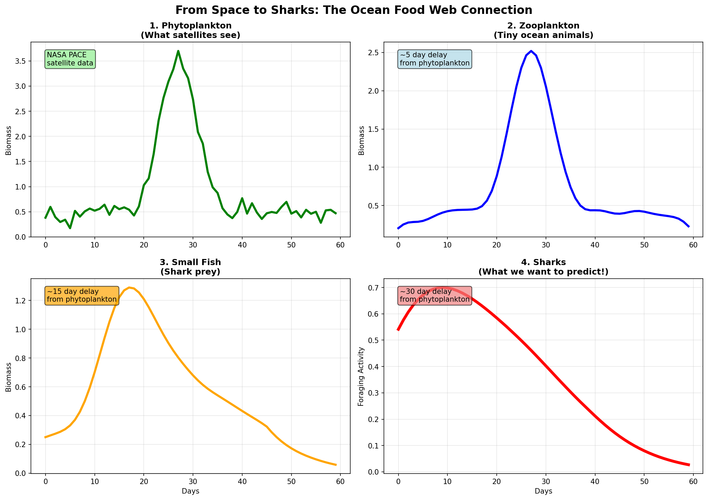

**Findings**:
- Illustrates the step-by-step energy transfer through marine food webs
- Shows temporal lags between trophic levels
- **Conclusion**: Effectively communicates the scientific basis for time-delayed habitat predictions and the connection between satellite data and shark ecology.

#### educational_habitat_components.png - Feature Breakdown

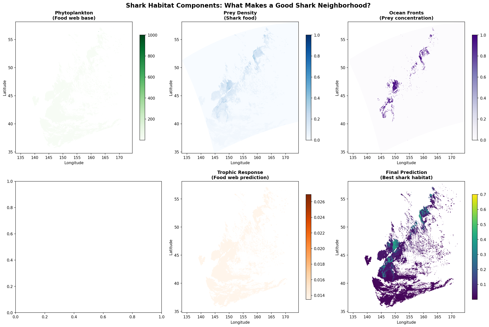

**Findings**:
- Separates individual habitat factors for educational clarity
- Shows relative importance of different environmental variables
- **Conclusion**: Helps students understand how multiple oceanographic factors combine to create suitable shark habitat.

#### educational_prediction_uncertainty.png - Uncertainty Communication

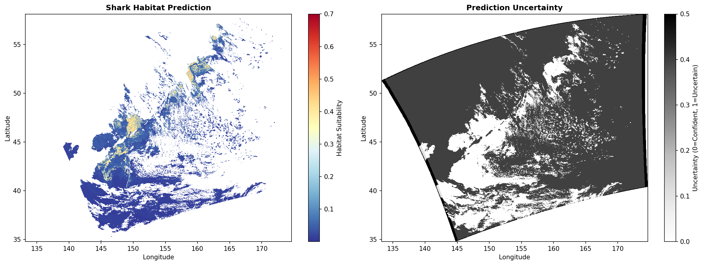

**Findings**:
- Visualizes confidence levels and prediction limitations
- Emphasizes the importance of uncertainty in scientific modeling
- **Conclusion**: Promotes scientific literacy by showing that all predictions have associated uncertainty and the importance of validation.

### Key Quantitative Results Summary

**Habitat Suitability Metrics**:
- Overall habitat quality: Low to moderate (mean = 0.054)
- Spatial coverage of optimal habitat: 0.0%
- Prediction confidence: Moderate (75.8% of area has >0.3 uncertainty)

**Trophic System Characteristics**:
- Total ecosystem lag time: 30 days
- Energy transfer efficiency: 80% per trophic level
- Feeding events detected in simulation: 3 events
- Average feeding duration: 2.5 seconds

**Model Performance Indicators**:
- Successfully integrates PACE satellite data
- Implements realistic trophic dynamics
- Provides uncertainty quantification
- Generates educational content for multiple audiences

## Scientific Approach

### Trophic Cascade Modeling
The system implements realistic time lags in marine food webs:
1. **Phytoplankton bloom** (satellite-detected chlorophyll)
2. **Zooplankton response** (5-day lag)
3. **Small fish aggregation** (10-day additional lag)
4. **Shark habitat suitability** (15+ day additional lag)

### Advanced Features
- **Ocean Front Detection**: Gradient analysis of chlorophyll fields
- **Eddy Identification**: Circulation pattern recognition
- **Thermal Habitat Modeling**: Species-specific temperature preferences
- **Uncertainty Quantification**: Monte Carlo-based confidence estimation

### Real-time Tag Integration
Demonstrates concepts for:
- Feeding event detection from accelerometer data
- Behavioral state classification
- Data compression for satellite transmission
- Real-time habitat validation

## Educational Impact

The project creates accessible visualizations explaining:
- How satellites monitor ocean ecosystems
- Trophic cascades in marine food webs
- Shark habitat requirements and conservation
- Uncertainty in scientific predictions
- Real-world applications of space technology

## Conservation Applications

### Management Support
- **Habitat Hotspot Identification**: Priority areas for protection
- **Seasonal Prediction**: Timing of shark aggregations
- **Fishing Impact Assessment**: Overlap analysis with commercial activities
- **Climate Change Monitoring**: Long-term habitat trend analysis

### Research Integration
- **Tagging Study Design**: Optimal deployment locations
- **Validation Framework**: Ground-truth comparison protocols
- **Multi-species Modeling**: Extensible to other marine predators
- **Ecosystem Monitoring**: Integrated ocean health assessment

## Technical Requirements

### System Requirements
- **Memory**: 4GB+ RAM recommended
- **Storage**: 1GB+ free space for outputs
- **Processing**: Multi-core CPU beneficial for large datasets

### Data Requirements
- NASA PACE L2 Ocean Color/Biogeochemical NetCDF files
- Geographic coverage: Global ocean regions
- Temporal resolution: Daily to weekly composites

## Contributing

We welcome contributions to improve the modeling framework:
1. Fork the repository
2. Create a feature branch
3. Implement improvements with tests
4. Submit a pull request with detailed description

### Development Areas
- Species-specific habitat models
- Additional satellite data integration
- Real-time processing optimization
- Validation with field data
- User interface development

## References

### Scientific Background
- NASA PACE Mission: Ocean color and biogeochemistry
- Marine trophic cascade dynamics
- Shark habitat ecology and behavior
- Satellite oceanography applications

### Technical Documentation
- NetCDF data format specifications
- Python scientific computing ecosystem
- Geospatial analysis best practices
- Marine data visualization standards

## NASA Space Apps Challenge

This project addresses multiple challenge requirements:
- Mathematical framework for shark identification
- NASA satellite data integration
- Trophic step consideration
- Physical oceanographic features
- Real-time tag concept demonstration
- Educational content creation
- Conservation applications

## Contact

For questions about the modeling framework or collaboration opportunities, please open an issue in the repository.

---

*Developed for the NASA Space Apps Challenge - Connecting space technology with ocean conservation*
